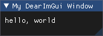

# "hello, world" with Dear ImGui

[Dear ImGui](https://github.com/ocornut/imgui) is a great library but it may not be easy to get a simple "hello, world". Indeed, Dear ImGui doesn't handle the display, keyboard and mouse by itself. A backend is required to do this:

> You will need a backend to integrate Dear ImGui in your app. The backend passes mouse/keyboard/gamepad inputs and variety of settings to Dear ImGui, and is in charge of rendering the resulting vertices.

A backend is something like SDL or OpenGL, stuffs that I am absolutely not familiar with, so it took me a while just to display a simple text.

Here is an "hello, world" project so you can get started easily!



## Run the project

The project builds with CMake.

From the command line:

```bash
git clone https://github.com/Bktero/HelloWorldWithDearImGui
cmake HelloWorldWithDearImGui\ -B build -G Ninja
cmake --build build
./build/HelloWorldWithDearImGui.exe
```

It will clone this repository, generate build files for Ninja with GCC, build the project and run the application. Of course, you can select the generator and compiler you want. I have successfully built the project on Windows 10 with mingw64/GCC 9.2 (with both Make and Ninja) and MSVC 2019.

## Under the hood

### Download dependencies from GitHub

The project uses the OpenGL + GLFW backend.

The `FetchContent` module is used in `CMakelists.txt` to download the dependencies from GitHub:

* [Dear ImGui](https://github.com/ocornut/imgui), obviously.
* [GLFW](https://github.com/glfw/glfw), used for the backend.
* [GLEW](https://github.com/Perlmint/glew-cmake.git), also used for the backend.

Note that the official GitHub for GLEW is [https://github.com/nigels-com/glew](https://github.com/nigels-com/glew) but it doesn't build properly with CMake. This [issue](https://github.com/nigels-com/glew/issues/291) suggests to use an alternative repository: [https://github.com/Perlmint/glew-cmake](https://github.com/Perlmint/glew-cmake).

### C++ standard version

Dear ImGui requires C++11. In C++98, GCC emits warnings:

>`warning: anonymous variadic macros were introduced in C++11 [-Wvariadic-macros]`
